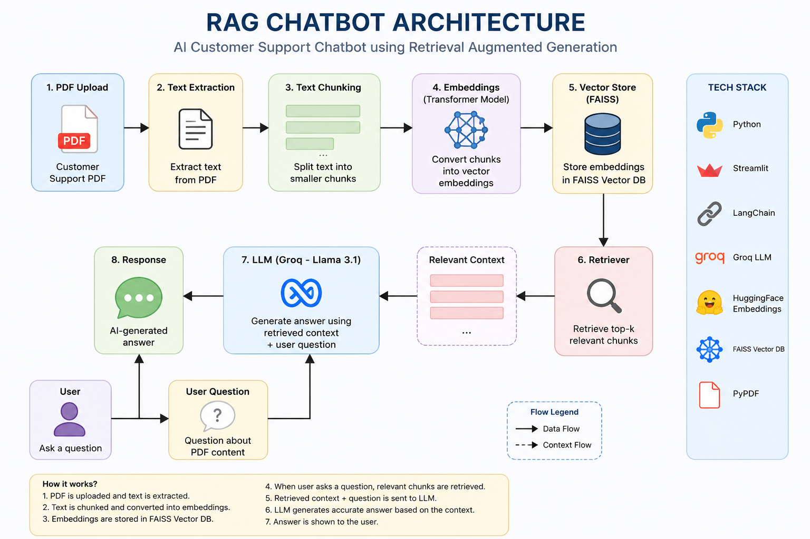
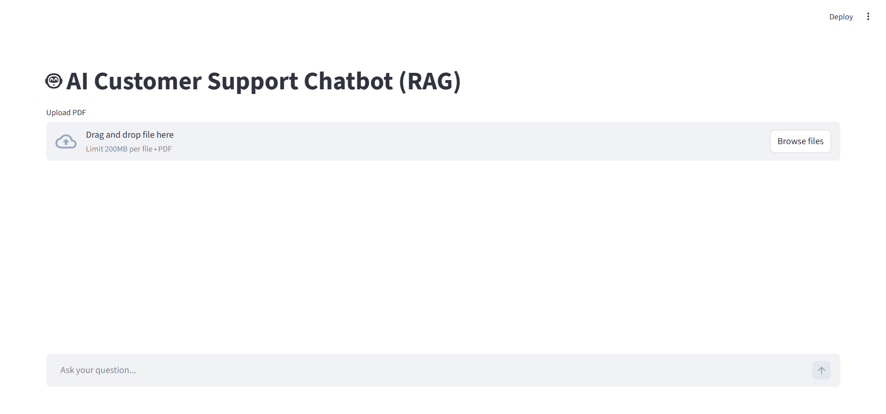
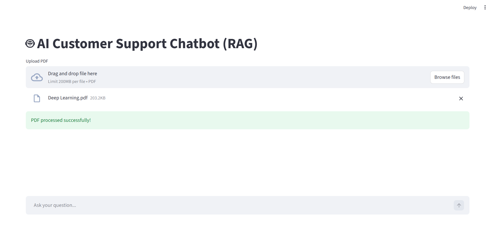
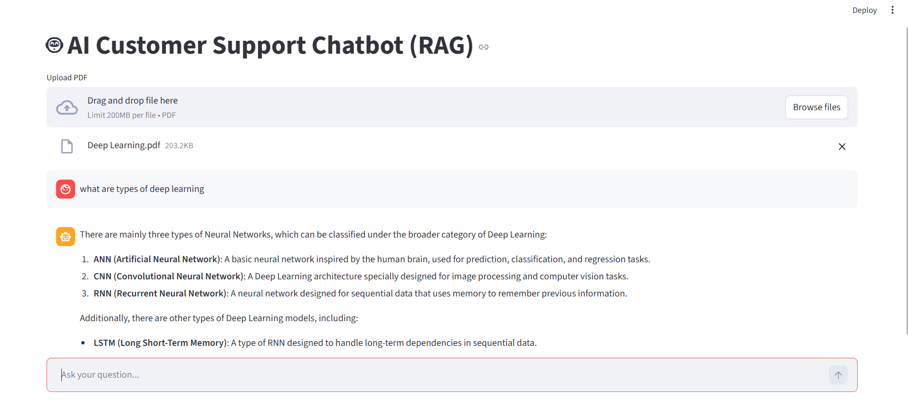

# 🤖 AI Customer Support Chatbot using RAG

An intelligent Retrieval-Augmented Generation (RAG) chatbot that allows users to upload PDF documents and ask questions using natural language.

The system uses semantic search and Large Language Models (LLMs) to generate context-aware answers from uploaded documents.

Built using LangChain, FAISS, Groq LLM, and Streamlit.

---

# 🚀 Features

* 📄 Upload and process PDF documents
* 🧠 Semantic search using FAISS vector database
* 🤖 AI-powered responses using Groq LLaMA 3.1
* 💬 ChatGPT-style conversational interface
* 📚 Context-aware question answering
* ⚡ Fast inference with Groq API
* 🔍 Retrieval-Augmented Generation (RAG) pipeline
* 🗂️ Multi-turn conversation memory

---

# 🧠 Architecture Diagram



---

# 📸 Demo

## 🏠 Home Screen



---

## 📄 PDF Upload



---

## 💬 Chat Interface



---

# ⚙️ How It Works

```text
PDF Upload
    ↓
Text Extraction
    ↓
Text Chunking
    ↓
Embeddings Generation
    ↓
FAISS Vector Database
    ↓
Retriever
    ↓
Groq LLM
    ↓
AI Response
```

---

# 🛠️ Tech Stack

| Technology             | Purpose                   |
| ---------------------- | ------------------------- |
| Python                 | Core Programming Language |
| Streamlit              | Frontend UI               |
| LangChain              | RAG Framework             |
| FAISS                  | Vector Database           |
| HuggingFace Embeddings | Text Embeddings           |
| Groq API               | LLM Inference             |
| PyPDF                  | PDF Processing            |

---

# 📂 Project Structure

```bash
AI Customer Support Chatbot/
│
├── app/
│   ├── __init__.py
│   ├── llm_handler.py
│   ├── main.py
│   ├── pdf_processor.py
│   ├── rag_pipeline.py
│   ├── ui.py
│   └── vector_store.py
│
├── assets/
│   ├── architecture.png
│   ├── home.png
│   ├── upload.png
│   └── chat.png
│
├── data/
│
├── .env
├── .gitignore
├── requirements.txt
└── README.md
```

---

# ⚙️ Installation

## 1️⃣ Clone Repository

```bash
git clone https://github.com/yourusername/rag_chatbot.git
```

---

## 2️⃣ Navigate to Project

```bash
cd rag_chatbot
```

---

## 3️⃣ Install Dependencies

```bash
pip install -r requirements.txt
```

---

## 4️⃣ Create `.env` File

Add your Groq API key:

```env
GROQ_API_KEY=your_api_key_here
```

---

## 5️⃣ Run Application

```bash
cd app

streamlit run main.py
```

---

# 🔑 Environment Variables

| Variable     | Description  |
| ------------ | ------------ |
| GROQ_API_KEY | Groq API Key |

---

# 📚 Key Learnings

* Implemented Retrieval-Augmented Generation (RAG)
* Built semantic search pipeline using FAISS
* Integrated Groq LLaMA 3.1 for fast inference
* Learned vector embeddings and document retrieval
* Developed modular AI application architecture

---

# 🚀 Future Improvements

* Multi-document support
* OCR support for scanned PDFs
* Authentication system
* Chat history database
* Cloud deployment
* Docker support

---

# 📄 License

This project is licensed under the MIT License.

---

# 👩‍💻 Author

Muskan Shaikh

Aspiring Data Scientist & AI/ML Engineer passionate about building intelligent AI applications using Machine Learning, NLP, and Generative AI.
